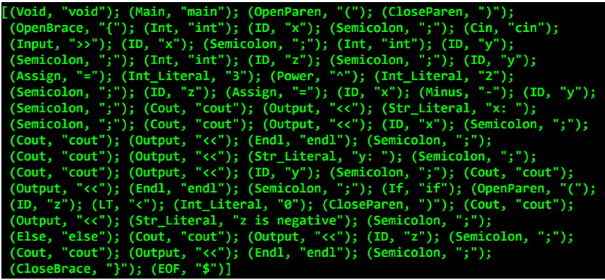
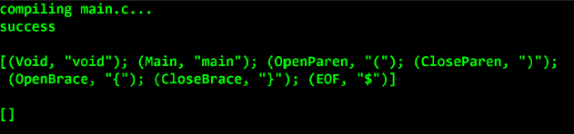

# Simple_C_Parser
#### F# program to parse simple C programs and find if the program is valid and free of syntax errors.

This program is going to parse simple C programs using recursive descent, and produce three results:
1. Is the input program a valid simple C program? True or false
2. If the program is not valid, a syntax error message of the
form “expecting X, but found Y”.
3. If the program is valid, an equivalent simple ASM program.
Note that “simple C” is really very simple C --- no pointers, no arrays,
no types other than integer, no loops, very simple expressions, etc. 

Here are some screenshots:

